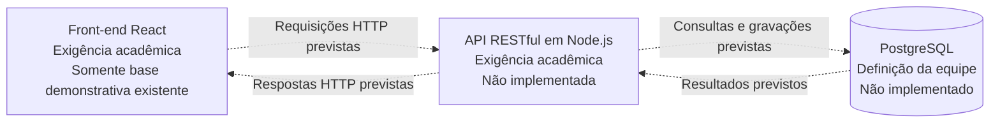

# Arquitetura — Seda e Couro

[Índice da documentação](README.md) · [Guia do Projeto](guia-do-projeto.md) · [Requisitos](requisitos.md) · [Regras de negócio](regras-de-negocio.md)

## 1. Objetivo e situação do documento

Este documento explica as partes do sistema, suas responsabilidades e a comunicação prevista, distinguindo o planejamento da implementação encontrada no repositório. Sua criação não aprova sugestões nem resolve decisões pendentes.

As classificações seguem o Guia, em “Como usar este documento”, e a [legenda do índice](README.md#como-interpretar-as-classificacoes):

| Classificação | Significado |
|---|---|
| **Exigência acadêmica** | Obrigação atribuída pelo guia à Orientação PI. |
| **Definição da equipe** | Definição do rascunho da equipe, conforme a legenda do guia; não significa implementação concluída. |
| **Sugestão** | Proposta não aprovada por esta documentação. |
| **Pendência** | Pendente de definição: falta decisão ou esclarecimento explicitamente identificado. |

Marcações de seções inteiras também se aplicam: os desenhos dos §§7.2–7.3, os fluxos do §8.1 e o modelo do §10 são sugestões. Os detalhes de telas do §5 são sugeridos, embora seus objetivos venham do rascunho. A exigência geral de validação e integração com a API tem marcação acadêmica própria.

**Situação da implementação** é registrada separadamente: configuração existente, código demonstrativo existente, ausência de implementação no repositório ou atendimento não demonstrado. Uma configuração encontrada é evidência técnica, não comprovação de aprovação formal. Nenhuma decisão técnica adicional explicitamente confirmada pela equipe foi identificada nas fontes desta edição.

A inspeção foi estática: leitura dos arquivos, sem execução da aplicação ou auditoria de ambientes externos. As afirmações de ausência se limitam ao repositório consultado. Requisitos e regras detalhados permanecem nos documentos próprios; aqui são referenciados por identificador.

## 2. Visão geral do sistema

**Definição da equipe — Guia §§1.1–1.4:** sistema web de gestão interna da sapataria Seda e Couro, desenvolvido no Projeto Integrado do UNIFEOB. O escopo funcional está em [RF-001 a RF-011](requisitos.md#rf-001).

**Planejamento:** interface React, API RESTful em Node.js, persistência em PostgreSQL e integração de dados. A classificação individual dessas partes está nas seções seguintes; o desenho geral do Guia §7.2 continua sendo uma sugestão, não uma topologia de implantação aprovada. Topologia significa como os componentes ficam distribuídos e conectados no ambiente.

**Implementação atual:** a entrada [frontend/index.html](../frontend/index.html) carrega [frontend/src/main.tsx](../frontend/src/main.tsx), que monta o componente [frontend/src/App.tsx](../frontend/src/App.tsx) com React e `StrictMode`. O componente exibe imagens, links e um contador mantido no estado local, sem chamadas à API ou persistência.

O back-end contém somente [backend/.gitkeep](../backend/.gitkeep), arquivo usado para manter a pasta no Git. Não há servidor de negócio, autenticação, endpoints, conexão com banco, migrações ou integração implementados. Isso é coerente com o aviso inicial do [README do projeto](../README.md) e com o [CHANGELOG](../CHANGELOG.md), em “Não lançado”.

## 3. Restrições e exigências arquiteturais

| Restrição ou exigência | Origem e classificação | Referência e situação atual |
|---|---|---|
| Interface React com componentes reutilizáveis e responsividade | Guia §§2.4 e 11.1: **Exigência acadêmica**; React também é **Definição da equipe** no §7.1. | [RNF-001](requisitos.md#rnf-001), [RNF-002](requisitos.md#rnf-002). Base demonstrativa existente; atendimento nas telas de negócio não demonstrado. |
| Validação de formulários e integração das telas com a API | Guia, introdução do §5, e §11.1: **Exigência acadêmica**. | [RF-013](requisitos.md#rf-013), [RF-014](requisitos.md#rf-014). Não implementadas nas funcionalidades de negócio. |
| API Node.js com métodos HTTP e endpoints versionados | Guia §§7.1 e 9–9.1: **Exigência acadêmica**; Node.js também consta no rascunho. | [RNF-003](requisitos.md#rnf-003). API ausente. Um endpoint é um endereço da API associado a operações. |
| Qualidade, consistência e segurança dos dados | Guia §8.2: **Exigência acadêmica**. | [RNF-004](requisitos.md#rnf-004), [RNF-005](requisitos.md#rnf-005). Atendimento não demonstrado; políticas e mecanismos pendentes. |
| TypeScript, Vite, Tailwind CSS e PostgreSQL | Guia §7.1: **Definição da equipe**. | [RNF-006](requisitos.md#rnf-006). Situações individuais na seção 7; classificação acadêmica ainda em revisão. |
| Aplicação e banco na nuvem, suporte a Node.js e execução automática da API | Guia §§2.4 e 12.2: **Exigência acadêmica**. | [RNF-008](requisitos.md#rnf-008). Implantação não configurada no repositório. |
| Documentar integração, comparar custos e elaborar plano de implantação | Guia §§8.3 e 12.3–12.4: **Exigência acadêmica**. | [RA-004](requisitos.md#ra-004), [RA-005](requisitos.md#ra-005). Documentação específica ainda planejada no índice. |

As exigências de consistência não aprovam automaticamente os fluxos operacionais sugeridos: ver [RN-018](regras-de-negocio.md#rn-018), [RN-019](regras-de-negocio.md#rn-019) e [PD-N07](regras-de-negocio.md#pd-n07).

## 4. Partes do sistema e suas responsabilidades

| Parte | Responsabilidade prevista | Origem e classificação | Limites e implementação |
|---|---|---|---|
| Front-end | Apresentar a interface, navegação e formulários, consumindo dados da API. | Guia §11.1: **Exigência acadêmica**. | Há somente a aplicação demonstrativa. A divisão detalhada em páginas, componentes e serviços é **Sugestão** do §7.3. |
| API | Receber solicitações HTTP e acessar o banco para manipular os dados do sistema. | Guia §§7.1 e 9: **Exigência acadêmica**. | Sem implementação; framework, organização interna e distribuição da lógica de negócio: **Pendente de definição**. |
| Integração de dados | Coletar, tratar, validar, armazenar e disponibilizar dados à API e às interfaces. | Guia §§2.4 e 8: **Exigência acadêmica**. | Sem implementação. Sua posição e forma de execução permanecem pendentes; o desenho e as pastas dos §§7.2–7.3 são sugestões. |
| Banco de dados | Persistir dados relacionais do sistema. | Guia §7.1: PostgreSQL como **Definição da equipe**. | Sem implementação. Entidades, campos e relações do §10 são **Sugestões**. |

Estas são responsabilidades lógicas: não implicam serviços separados, processos independentes, MVC ou outro padrão arquitetural. O guia não escolhe tais padrões. A pasta sugerida `controllers/` não comprova uma decisão sobre eles.

## 5. Comunicação entre front-end, API e banco

O fluxo principal previsto é: a interface envia solicitações HTTP à API; a API acessa o banco e devolve uma resposta à interface. HTTP é o protocolo de comunicação usado pela API. Origem: Guia §§1.2, 7.1, 9 e 11.1, de **exigência acadêmica**, com PostgreSQL definido pela equipe no §7.1.



**Legenda:** todas as setas tracejadas representam conexões planejadas, ainda não implementadas. Elas não significam que as exigências acadêmicas sejam opcionais. O front-end existe apenas como exemplo; suas funcionalidades de negócio também estão previstas. Os resultados retornam do banco à API, e as respostas retornam da API à interface. Não há acesso direto do navegador ao banco neste fluxo.

O diagrama é uma síntese da comunicação principal, não uma aprovação integral do desenho sugerido no Guia §7.2. A integração de dados foi deixada fora de uma posição fixa porque essa posição está **Pendente de definição**, conforme seção 6. O diagrama não decide onde APIs externas ou arquivos serão processados.

**Sugestões não aprovadas — Guia §§7.2 e 9.2–9.4:** JSON uniforme (formato textual para troca de dados), prefixo `/api/v1`, transição para `/api/v2`, recursos e convenções de respostas. Referências: [RNF-009](requisitos.md#rnf-009) e [RNF-010](requisitos.md#rnf-010). Exigir versionamento não aprova esses contratos específicos. Um contrato descreve os endereços, entradas e respostas combinados entre as partes.

Não há chamadas à API em `frontend/src/App.tsx`, nem proxy de API em [frontend/vite.config.ts](../frontend/vite.config.ts). Biblioteca de navegação, implementação das chamadas e endereços de serviço estão **Pendentes de definição**.

## 6. Integração de dados

A existência de uma camada de integração é **Exigência acadêmica** do Guia §8. Os fluxos abaixo são **Sugestões não aprovadas**, conforme a marcação de toda a seção §8.1; nenhum está implementado.

| Origem prevista | Tratamento previsto na fonte | Destino previsto | Referência para detalhes e pendências |
|---|---|---|---|
| Formulários React | Validação de campos e formatos, remoção de espaços e padronização | PostgreSQL, via API | [RF-013](requisitos.md#rf-013) e [PD-N03](regras-de-negocio.md#pd-n03); campos obrigatórios não definidos por esta tabela. |
| API pública de CEP | Validação de CEP e tratamento de indisponibilidade | Endereço do cliente | [RF-026](requisitos.md#rf-026), [PD-R10](requisitos.md#pd-r10); ViaCEP é exemplo, não escolha aprovada. |
| Planilhas CSV, se existirem | Colunas, duplicados e conversão de tipos | Clientes e estoques | [RF-027](requisitos.md#rf-027), [PD-R10](requisitos.md#pd-r10); existência e formato das planilhas não confirmados. |
| Vendas e OS | Movimentações automáticas e totais | Estoques e financeiro | [RN-011](regras-de-negocio.md#rn-011), [RN-012](regras-de-negocio.md#rn-012) e [PD-N07](regras-de-negocio.md#pd-n07). |
| OS, vendas e materiais | Agregação e cálculo por período | Dashboard financeiro | [RF-025](requisitos.md#rf-025) e [PD-N06](regras-de-negocio.md#pd-n06); fórmulas não definidas aqui. |

**Ambiguidade preservada:** o Guia §7.2 sugere fontes → integração → banco; o §8.1 indica cadastros chegando ao PostgreSQL via API; o §7.3 sugere `integration/` dentro do back-end. São representações incompletas de relações distintas. Está **Pendente de definição** como a API aciona a integração, onde cada fluxo executa e qual parte acessa o banco em cada caso. Não se deduz acesso direto do navegador nem um serviço independente de importação.

O Guia §8.3 exige documentar os fluxos; origem, transformações, validações, destino, erros e a pasta `docs/integracao/` constituem seu modelo **sugerido**. Ver [RA-004](requisitos.md#ra-004).

## 7. Tecnologias e situação atual

| Tecnologia ou ferramenta | Finalidade e origem da definição | Evidência atual |
|---|---|---|
| React / React DOM | Interface; React é **Exigência acadêmica** e **Definição da equipe** no Guia §7.1. | Declarados em [frontend/package.json](../frontend/package.json), usados em `src/main.tsx` e `src/App.tsx`. Somente exemplo implementado. |
| TypeScript | Tipagem para reduzir erros e facilitar manutenção; **Definição da equipe**, Guia §7.1. | Arquivos `.ts`/`.tsx` e [tsconfig.app.json](../frontend/tsconfig.app.json). Divergência de classificação com §14 permanece em PD-R03. |
| Vite | Servidor de desenvolvimento e build, isto é, geração dos arquivos da aplicação; **Definição da equipe**, Guia §7.1. | Scripts em `frontend/package.json` e plugins em `frontend/vite.config.ts`. Não define o servidor de produção. |
| Tailwind CSS | Estilização com classes utilitárias; **Definição da equipe**, Guia §7.1. | Ausente das dependências declaradas e da configuração. O exemplo usa [index.css](../frontend/src/index.css) e [App.css](../frontend/src/App.css). |
| Node.js | Ambiente da API; **Exigência acadêmica** e **Definição da equipe**, Guia §§7.1 e 9. | Back-end sem código. As ferramentas do front-end e [tsconfig.node.json](../frontend/tsconfig.node.json), que inclui a configuração do Vite, não comprovam API implementada. |
| PostgreSQL | Persistência relacional; **Definição da equipe**, Guia §7.1. | Sem conexão, esquema ou migrações no repositório. Migrações são scripts de evolução da estrutura do banco; seu mecanismo ainda não foi escolhido. |
| ESLint | Análise estática do código, conforme README e CONTRIBUTING. | [eslint.config.js](../frontend/eslint.config.js) e script `lint`. Fato de configuração; não é nova exigência atribuída ao guia. |
| React Compiler e plugins de React/Babel | Configuração observada, sem decisão ou justificativa específica registrada nas fontes. | `frontend/vite.config.ts` usa `reactCompilerPreset()` por meio do plugin Babel. Isso não comprova benefício de desempenho nem aprovação arquitetural formal. |
| npm e lockfile | Instalação e scripts descritos no README, “Como rodar”. | [package.json](../frontend/package.json) e [package-lock.json](../frontend/package-lock.json) existentes. Não há script de testes automatizados declarado. |

Fatos de configuração não recebem automaticamente a classificação “Definição da equipe”. Quando a origem decisória não está registrada, ela permanece não informada. Os scripts `dev`, `build`, `lint` e `preview` estão configurados, mas não foram executados para esta inspeção.

## 8. Organização atual e proposta do projeto

### Estrutura atual

Resumo dos arquivos encontrados; dependências instaladas e saídas geradas não são tratadas como código de funcionalidades.

```text
pi-sapataria/
|-- frontend/
|   |-- public/                 # arquivos estáticos do exemplo
|   |-- src/
|   |   |-- assets/             # imagens do exemplo
|   |   |-- main.tsx            # montagem do React
|   |   |-- App.tsx             # componente demonstrativo
|   |   |-- index.css
|   |   |-- App.css
|   |-- index.html
|   |-- package.json
|   |-- package-lock.json
|   |-- vite.config.ts
|   |-- tsconfig*.json
|   |-- eslint.config.js
|-- backend/
|   |-- .gitkeep                # pasta reservada; sem API
|-- docs/
|   |-- README.md
|   |-- guia-do-projeto.md
|   |-- requisitos.md
|   |-- regras-de-negocio.md
|   |-- arquitetura.md         # este documento
|-- README.md
|-- CONTRIBUTING.md
|-- CHANGELOG.md
|-- .gitignore
```

### Organização sugerida pelo guia

**Sugestão não aprovada — Guia §7.3.** As subpastas abaixo não foram criadas por este documento. A árvore mostra apenas os agrupamentos propostos, não a estrutura atual completa.

```text
frontend/src/
|-- pages/          # telas
|-- components/     # elementos reutilizáveis
|-- services/       # chamadas à API
|-- types/          # tipos TypeScript

backend/src/
|-- routes/         # rotas da API
|-- controllers/    # lógica de cada rota no exemplo do guia
|-- integration/    # coleta, transformação e validação
|-- database/       # conexão e scripts do banco

docs/
|-- sprints/
|-- reunioes/
|-- integracao/
|-- nuvem/
```

Os componentes nomeados no Guia §11.4 também são **Sugestões**, não uma biblioteca existente. Referência: [RNF-011](requisitos.md#rnf-011). O detalhamento dos limites entre rotas, lógica de negócio, integração e persistência permanece **Pendente de definição**.

## 9. Segurança e controle de acesso

**Exigência acadêmica — Guia §8.2:** segurança e acesso por perfil conforme [RNF-005](requisitos.md#rnf-005). O texto usa “senhas criptografadas”, exige consultas parametrizadas e segredos fora do repositório. Consultas parametrizadas separam valores fornecidos da estrutura da consulta. O mecanismo de armazenamento de senhas não é escolhido nesta documentação.

**Definição da equipe:** a exclusividade do cadastro de funcionários está em [RN-001](regras-de-negocio.md#rn-001). Perfis, proteção das telas e demais permissões mantêm suas classificações em [RN-002](regras-de-negocio.md#rn-002), [RN-003](regras-de-negocio.md#rn-003) e [RN-004](regras-de-negocio.md#rn-004). Ocultar um item de menu não comprova autorização implementada; a ambiguidade de apresentação está em [RN-005](regras-de-negocio.md#rn-005).

**Pendente de definição:** mecanismos de autenticação e autorização, política de senha e matriz de acesso. Nenhuma biblioteca, algoritmo, sessão ou token foi escolhido nas fontes. Divergência de classificação entre §§8.2, 9.4 e 14: [PD-R04](requisitos.md#pd-r04). Permissões e autenticação: [PD-N01](regras-de-negocio.md#pd-n01) e [PD-N02](regras-de-negocio.md#pd-n02).

**Situação atual:** não há implementação desses mecanismos. O [.gitignore](../.gitignore) exclui dependências e builds, mas não contém regra explícita para `.env`; o CONTRIBUTING, em “Padrões de código e commits”, já registra essa limitação e orienta seu tratamento se tais arquivos forem introduzidos. Este documento não altera essa configuração nem inclui credenciais.

## 10. Hospedagem e implantação previstas

| Informação | Origem e classificação | Situação e limite |
|---|---|---|
| Aplicação e banco na nuvem, suporte a Node.js e API em execução automática | Guia §12.2: **Exigência acadêmica**. | [RNF-008](requisitos.md#rnf-008). Não há configuração de implantação no repositório. |
| AWS Academy como plano A | Guia §§2.4 e 12.2; também descrito no README. | **Pendente de definição** se é preferência ou provedor definitivo: a nota do §12.1 usa “hospedagem oficial”. |
| PM2 ou serviço do sistema com reinício automático | Guia §12.2: **Sugestão não aprovada** para manter a API em execução. | Nenhuma opção configurada. |
| Serviços das tabelas AWS, Azure e Google Cloud | Guia §12.3: **Sugestão não aprovada**, como referência para levantamento de custos. | Não representam serviços contratados ou escolhidos. |
| Comparação de custos e plano de implantação | Guia §§12.3–12.4: **Exigência acadêmica**. | [RA-005](requisitos.md#ra-005); conteúdo detalhado e pasta do plano são sugeridos. |
| GitHub Pages e opção de HashRouter | Guia §12.6: **Sugestão não aprovada**, para demonstração complementar do front-end. | `vite.config.ts` não aplica o `base` exemplificado; não há roteador implementado. Não substitui API e banco na nuvem. |
| Domínio e hospedagem paga após o PI, se houver uso real | Guia §12.5: **Definição da equipe condicional**. | Nome e contratação não definidos; [PD-R16](requisitos.md#pd-r16). |

O Guia §12.1 descreve desenvolvimento local antes da etapa de nuvem e admite testes já em nuvem sob a condição acadêmica de a equipe preparar o ambiente. Isso não comprova que algum ambiente externo já exista.

**Pendente de definição:** como os arquivos do front-end serão servidos em produção. O §12.2 associa suporte a Node.js ao funcionamento de front-end e back-end; o código atual monta React no navegador e configura Vite para desenvolvimento/build. Não há servidor de produção da interface nem renderização no servidor configurados. Não se deduz um processo Node.js de produção para a interface somente a partir das ferramentas de desenvolvimento.

## 11. Decisões arquiteturais e justificativas registradas

A tabela distingue a finalidade registrada de uma justificativa comparativa. Não há novas aprovações técnicas nesta edição.

| Item | Origem e situação da definição | Justificativa ou finalidade registrada | Limite do registro |
|---|---|---|---|
| React | Guia §§7.1 e 11.1: **Exigência acadêmica** e **Definição da equipe**. | Interface com componentes reutilizáveis. | Não há comparação com outras bibliotecas. |
| Node.js e API RESTful | Guia §§7.1 e 9: **Exigência acadêmica**; Node.js também consta no rascunho. | Receber pedidos HTTP e acessar dados. | Framework e organização interna não escolhidos. |
| TypeScript | Guia §7.1: **Definição da equipe**; divergência no §14. | Tipagem para reduzir erros e facilitar manutenção. | Não há avaliação de alternativas registrada. |
| Vite | Guia §7.1: **Definição da equipe**. | Desenvolvimento e build do front-end. | Motivo de escolha frente a outras ferramentas não registrado. |
| PostgreSQL | Guia §7.1: **Definição da equipe**. | Armazenamento relacional dos dados. | Critério comparativo de seleção não registrado. |
| Tailwind CSS | Guia §7.1: **Definição da equipe**. | Classes utilitárias aplicando a paleta da empresa. | Comparação de abordagens não registrada; ainda não configurado. |
| Nuvem para a aplicação completa | Guia §§12.1–12.2: obrigação acadêmica; nota de ajuste do rascunho. | O guia explica que Pages sozinho não executa a API Node.js nem PostgreSQL. | Essa justificativa não decide serviços específicos nem resolve a divergência sobre AWS Academy. |
| React Compiler | Evidência em `frontend/vite.config.ts`; decisão formal não informada. | Justificativa específica não registrada. | Configuração não comprova ganho de desempenho ou motivo da adoção. |

O fato de os arquivos estarem no repositório não substitui o registro de uma decisão arquitetural. Mudanças futuras devem conservar a origem anterior e registrar separadamente a decisão explicitamente confirmada pela equipe.

## 12. Pendências, divergências e sugestões não aprovadas

Todas as decisões abaixo permanecem **Pendentes de definição**. Quando já existe identificador nos outros documentos, ele é reutilizado; as lacunas arquiteturais adicionais são descritas sem criar decisões por inferência.

| Tema | O que precisa ser decidido ou esclarecido | Origem e referência |
|---|---|---|
| Posição da integração | Onde cada fluxo executa e como se relaciona com API e persistência; reconciliar as representações incompletas. | Guia §§7.2–7.3 e 8.1; seção 6 deste documento; [PD-R09](requisitos.md#pd-r09). |
| Organização do back-end | Limites das responsabilidades, framework HTTP e mecanismo de acesso/evolução do banco. Nenhuma ferramenta específica está definida. | Guia §§7.3 e 9; `backend/.gitkeep`; [PD-R09](requisitos.md#pd-r09). |
| Navegação e chamadas do front-end | Mecanismo de navegação, chamadas à API e endereços dos serviços. | Guia §§11.1 e 7.3; `frontend/src/App.tsx` e `frontend/vite.config.ts`; [PD-R09](requisitos.md#pd-r09). |
| Contratos da API e modelo de dados | Aprovar ou revisar prefixos, recursos, respostas e modelos sugeridos, sem transformar campos em obrigatórios por inferência. | Guia §§9.2–9.4 e 10; [PD-R09](requisitos.md#pd-r09), [PD-N03](regras-de-negocio.md#pd-n03). |
| Segurança | Esclarecer classificação mista, mecanismos e permissões, incluindo Configuração e Financeiro. | Guia §§3, 8.2, 9.4 e 14; [PD-R04](requisitos.md#pd-r04), [PD-N01](regras-de-negocio.md#pd-n01), [PD-N02](regras-de-negocio.md#pd-n02). |
| Classificação de manutenção e tecnologias | Reconciliar §14 com §§7.1/11.1; confirmar o enquadramento acadêmico de TypeScript, Vite, Tailwind e PostgreSQL. | [PD-R03](requisitos.md#pd-r03), [PD-R05](requisitos.md#pd-r05). |
| Identidade visual e Tailwind | Definir paleta e implementar a escolha prevista. CSS do exemplo não comprova abandono do Tailwind nem identidade aprovada. | Guia §§7.1 e 11.6; arquivos CSS atuais; [PD-R07](requisitos.md#pd-r07). |
| Integrações externas | Decidir adoção e execução de CEP/CSV, provedor, formatos e tratamento de falhas. | Guia §8.1; [PD-R10](requisitos.md#pd-r10). |
| Nuvem e interface em produção | Reconciliar “plano A” e “hospedagem oficial”; escolher serviços e execução contínua; definir como servir a interface. | Guia §§12.1–12.4; `frontend/package.json`; [PD-R06](requisitos.md#pd-r06). |
| Comportamento que afeta persistência | Resolver estados, pagamentos, cálculos, momentos de baixa e operações conjuntas; não escolher mecanismo antes de tratar os limites documentados. | Guia §§5–6 e 8.2; [PD-N04](regras-de-negocio.md#pd-n04), [PD-N05](regras-de-negocio.md#pd-n05), [PD-N06](regras-de-negocio.md#pd-n06), [PD-N07](regras-de-negocio.md#pd-n07). |
| Metas e backup | Avaliar e definir parâmetros ainda ausentes, sem inventar disponibilidade garantida, tempo de resposta ou frequência de cópias. | Guia §14; [PD-R08](requisitos.md#pd-r08). |
| Colaboração | Reconciliar sugestões do guia com a redação normativa do CONTRIBUTING. | Guia §13.2; CONTRIBUTING, “Fluxo de trabalho”; [PD-R01](requisitos.md#pd-r01). |

**Sugestões não aprovadas já presentes nas fontes:** organização de pastas e componentes, modelo de dados, integrações de CEP/CSV, convenções específicas da API, mecanismos de execução contínua, serviços exemplificados de nuvem, Pages/HashRouter e backup. Sua finalidade e origem estão nas seções correspondentes; nenhuma foi promovida a decisão neste documento.

O estágio inicial descrito no README é coerente com o código consultado. Diferenças entre planejamento e implementação são registradas como trabalho previsto; divergências entre fontes permanecem abertas. Não foram acrescentadas alternativas técnicas novas.
