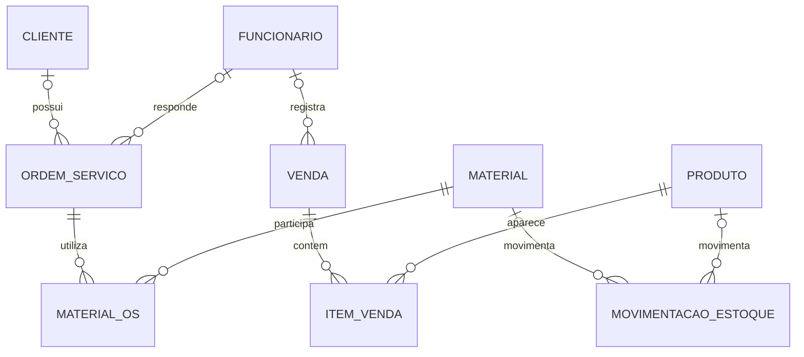

# Modelo de dados — visão inicial do sistema

[Índice](README.md) · [Guia do Projeto](guia-do-projeto.md) · [Contrato da API](api.md) · [Telas e fluxos](telas-e-fluxos.md)

## Escopo e situação

Modelo inicial do banco completo, sujeito a evolução. O contrato da API e o documento de telas apresentam o mesmo conjunto de funcionalidades, com detalhes pendentes marcados localmente; cadastro/listagem de clientes permanece como primeiro recorte de implementação.

- **Definição da equipe:** objetivos dos módulos (Guia §§1.3, 4 e 5; RF-003 a RF-011), PostgreSQL (§7.1), cadastro de funcionários exclusivo do administrador (RN-001) e venda independente de OS (RN-008).
- **Exigência acadêmica:** validação, chaves estrangeiras, consistência, estoque não negativo e segurança (§8.2; RNF-004/RNF-005, RN-018/RN-019).
- **Sugestões das fontes:** entidades e campos do §10, detalhes do §5 e fluxos do §6. Sua presença neste modelo não os aprova.
- **Propostas técnicas desta versão:** nomes de tabelas/campos, tipos, chaves e cardinalidades abaixo. Nenhum esquema foi implementado ou aprovado por esta edição.
- **Pendências de negócio:** apontadas junto aos elementos afetados, por identificadores de [regras de negócio](regras-de-negocio.md#pendencias). Ausência de definição não significa campo opcional.

**Situação observada:** `backend/.gitkeep` apenas reserva a pasta; não há modelo de negócio, conexão ou migração no repositório. Referência: [Arquitetura §§4, 7 e 12](arquitetura.md). Nenhuma migração foi gerada e nenhum banco foi alterado.

## Convenções propostas

**PK** é a chave primária: identifica uma linha. **FK** é a chave estrangeira: aponta para uma linha existente de outra tabela. Por exemplo, `cliente_id` aponta para `clientes.id`.

Todas as nove tabelas principais terão, **como proposta**, `id integer` gerado pelo banco, PK, único e não nulo. As FKs usam `integer`. Essa exigência técnica de identificação não torna obrigatório um dado cadastral.

Nas tabelas seguintes, **Pendente** significa obrigatoriedade de negócio ainda não definida (PD-N03); **Proposta: sim** indica uma restrição estrutural sugerida, não aprovada. Campos agrupados mantêm o mesmo tipo e situação. Não se propõem limites de texto, valores padrão, unicidade de nomes/contatos ou exclusões em cascata. Remoção/desativação e preservação de históricos permanecem em PD-N09.

Tipos propostos: `text` para texto; `boolean` para ativo/inativo; `numeric` para valores e quantidades exatas, com precisão, escala e arredondamento a definir conforme unidades e regras financeiras; `date` para datas sem horário; `timestamptz` para instantes com referência de fuso. Essas escolhas não definem períodos financeiros nem admitem automaticamente quantidades fracionadas em todos os produtos. Para o contrato da API, propõe-se serializar `numeric` como string decimal, `date` como `YYYY-MM-DD` e `timestamptz` como string ISO 8601 com fuso; IDs continuam números inteiros. São representações de transporte, não novas regras de cálculo.

## Diagrama geral — proposta, não implementada

As relações partem do Guia §10; **todas as cardinalidades são propostas técnicas para revisão**. `||` significa exatamente um; `o|`, zero ou um; `o{`, zero ou vários. A ausência de obrigatoriedade confirmada é representada provisoriamente por zero ou um nas referências de OS e Venda; isso **não autoriza registros sem cliente ou responsável** antes da decisão de negócio.

Um cliente pode estar associado a várias OS; cada OS aponta para no máximo um cliente neste desenho. Um funcionário pode responder por várias OS e registrar várias vendas. Confirmar se a loja precisa de mais de um responsável por OS antes de mudar essa estrutura (PD-N03).

Uma OS pode utilizar vários materiais e o mesmo material pode aparecer em várias OS: `MATERIAL_OS` registra cada uso. Da mesma forma, `ITEM_VENDA` liga uma venda aos produtos vendidos. A proposta exige os dois vínculos em cada linha dessas tabelas intermediárias. O diagrama não decide o mínimo de itens para concluir uma venda, nem se o mesmo produto/material pode aparecer repetido na mesma operação (PD-N03/PD-N07).

Cada movimentação aponta **para um Material ou um Produto, nunca ambos**, conforme proposta de restrição abaixo; as duas ligações opcionais no diagrama devem ser lidas juntas com essa condição.

**Relações ainda não desenhadas:** Cliente–Venda (histórico de compras sugerido no §5.3, mas ausente no §10) e OS–Venda (vendas ligadas a OS no §1.3, sem modelo correspondente no §10). A existência de venda independente está definida, mas não resolve como representar as vendas ligadas a OS. Cardinalidade e campos desses vínculos permanecem pendentes; não se cria tabela adicional nem FK por suposição (PD-N03/PD-N05).

## Entidades e campos

### Funcionário/usuário — `funcionarios`

**Finalidade:** identificar quem acessa o sistema e quem registra operações. Uma entidade atende cadastro e perfil do usuário, sem duplicar a pessoa por tela. **Origem:** Guia §§5.5, 5.9 e 10; RF-005/RF-009 definidos no nível de objetivo; detalhes em RF-019/RF-023 são sugestões. Administração do cadastro segue RN-001.

| Campo (além de `id`) | Finalidade / tipo proposto | Obrigatoriedade | Restrição ou pendência |
|---|---|---|---|
| `nome` | Identificação / `text` | Pendente | Dados pessoais exatos e formatos: PD-N03. |
| `email` | Contato e possível identificador de entrada / `text` | Pendente | Login por e-mail ou usuário ainda não decidido; não presumir unicidade de contato (PD-N02). |
| `senha_protegida` | Representação protegida da senha / `text` | Pendente, conforme autenticação | Nunca senha em texto aberto nem dado devolvido na API. Mecanismo e política ainda não escolhidos (PD-R04/PD-N02). |
| `perfil` | Perfil de acesso / `text` | Pendente | Administrador/funcionário são sugestões; não fixar enumeração, privilégios ou padrão antes de PD-N01. |
| `ativo` | Estado de acesso / `boolean` | Pendente | Sem valor padrão; efeitos sobre acesso já iniciado e autoria histórica: PD-N02/PD-N09. |

Se login por nome de usuário for aprovado, o identificador correspondente precisará ser incluído e ter sua unicidade definida. Não se cria agora uma tabela de permissões ou recuperação de senha sem mecanismo escolhido. Outros contatos só entram após confirmar necessidade (§5.5).

## Cliente

**Tabela proposta:** `clientes`. **Finalidade:** organizar identificação e contato de quem solicita serviços.

Os cinco campos de negócio vêm das **sugestões** dos §§5.3 e 10, reunidas em [RF-017](requisitos.md#rf-017). Nomes técnicos sem acentos, tipos, identificação e representação de ausência abaixo são **propostas técnicas desta versão, ainda não adotadas**. Não há campo CPF previsto neste recorte.

| Campo | Finalidade | Tipo proposto (PostgreSQL / JSON) | Obrigatoriedade | Restrições |
|---|---|---|---|---|
| `id` | Identificar o registro sem depender de nome ou telefone | `integer` / número inteiro | Proposta: gerado pelo banco, presente na resposta; não preenchido no formulário | Proposta: chave primária, única e não nula; não é regra de identificação civil. |
| `nome` | Nome do cliente | `text` / string | Pendente de definição | Formato e limites pendentes; não presumir unicidade. |
| `telefone` | Contato telefônico | `text` / string | Pendente de definição | Formato pendente; texto preserva sinais e zeros; não presumir unicidade. |
| `email` | Contato por e-mail | `text` / string | Pendente de definição | Validação de formato exigida se adotado; regra concreta pendente; não presumir unicidade. |
| `endereco` | Endereço do cliente | `text` / string | Pendente de definição | Texto único é proposta; não pressupõe CEP ou consulta externa. |
| `observacoes` | Anotações cadastrais | `text` / string | Pendente de definição | Conteúdo e limites pendentes. |

**Proposta de representação:** para campos que forem aprovados como opcionais, ausência no pedido ou `null` representa ausência de valor; no banco, `NULL`; na resposta, a chave permanece com `null`. Isso não torna os cinco campos opcionais. Tratamento de texto vazio e normalização deve acompanhar as validações aprovadas. `id` é somente de leitura para o cliente da API.

## Pendências que afetam o cadastro e a listagem

- **Dados — PD-N03:** equipe e sapataria precisam confirmar os campos deste recorte, quais são obrigatórios e quais formatos aceitar. Não interpretar ausência de definição como permissão para salvar cadastro vazio. Nenhuma regra de rejeição ou fusão de duplicados está autorizada por este modelo.
- **Acesso — PD-N01/PD-N02:** confirmar quem pode cadastrar e quem pode listar; a proteção depende da definição de autenticação. Ver [permissões no contrato](api.md#permissoes).
- **Técnica — PD-R09:** alinhar os tipos e a representação propostos com o contrato e escolher acesso ao banco/migrações antes da implementação da persistência. São escolhas ainda não adotadas, não novas regras da sapataria.

Critérios práticos compartilhados estão em [Telas e fluxos](telas-e-fluxos.md#verificacao). CEP, CSV e histórico continuam com suas classificações originais; não precisam ser resolvidos para preparar este cadastro.

## Ordem de serviço — `ordens_servico`

**Finalidade:** registrar e acompanhar o reparo. **Origem:** Guia §§5.4, 6.1 e 10; RF-004 definido, detalhes RF-018/RN-010 sugeridos. A seção §5.4 menciona serviço(s), pagamento e observações; o §10 resume serviço no singular e acrescenta responsável. As diferenças permanecem explícitas.

| Campo (além de `id`) | Finalidade / tipo proposto | Obrigatoriedade | Restrição ou pendência |
|---|---|---|---|
| `cliente_id` | Cliente atendido / `integer`, FK → `clientes.id` | Pendente | Até um cliente no desenho; confirmar vínculo obrigatório (PD-N03). |
| `responsavel_id` | Funcionário responsável / `integer`, FK → `funcionarios.id` | Pendente | Não confundir automaticamente responsável e autor do cadastro (PD-N03). |
| `descricao_calcado` | Identificar o calçado / `text` | Pendente | Formato e conteúdo: PD-N03. |
| `servico` | Descrever trabalho solicitado / representação pendente | Pendente | Texto único ou vínculo com catálogo; um ou vários serviços: PD-N03/PD-N04. Não definir FK antes dessa decisão. |
| `valor` | Valor do serviço / `numeric` | Pendente | Composição e validação pendentes; não presume pagamento ou faturamento (PD-N05/PD-N06). |
| `data_entrada` | Data de recebimento / `date` | Pendente | Horário não está definido; sem preenchimento automático aprovado. |
| `prazo_entrega` | Data prevista / `date` | Pendente | Prazo padrão e validação entre datas: PD-N04. |
| `status` | Situação do serviço / `text` | Pendente | Estados e transições de RN-010 são sugestões; sem valor inicial presumido. |
| `forma_pagamento` | Forma informada / representação pendente | Pendente | Texto ou FK ao cadastro auxiliar; momento de registro e formas aceitas: PD-N05. |
| `observacoes` | Anotações sobre a OS / `text` | Pendente | Previsto no §5.4, ausente da tabela resumida do §10; confirmar adoção (PD-N03). |

Materiais ficam em `materiais_os`, não em uma lista de IDs dentro da OS. Não se cria tabela Pagamento, parcelamento ou data de recebimento por inferência: retirada e pagamento em momentos diferentes ainda precisam de regra (PD-N05). A solução dessa pendência poderá exigir evolução do modelo antes do financeiro.

## Estoques — `materiais` e `produtos`

**Finalidades:** Material representa insumo consumido no reparo; Produto representa item para venda. **Origem:** Guia §§5.7–5.8 e 10; RF-007/RF-008 definidos, detalhes RF-021/RF-022 sugeridos.

| Tabela / campo (além de `id`) | Tipo proposto | Obrigatoriedade | Finalidade, restrição ou pendência |
|---|---|---|---|
| Ambas: `nome` | `text` | Pendente | Identificar item; sem unicidade presumida. |
| Ambas: `categoria` | Representação pendente | Pendente | Classificação; texto ou FK conforme avaliação dos auxiliares (§5.10). |
| Ambas: `quantidade` | `numeric` | Pendente | Saldo atual. **Exigência:** nunca negativo (RN-019); proposta de restrição `>= 0`, sem padrão zero presumido. |
| Material: `unidade` | `text` | Pendente | Como medir o consumo; unidades e frações precisam de confirmação (PD-N03). |
| Material: `quantidade_minima` | `numeric` | Pendente | Mínimo para alerta sugerido; adoção e valor em PD-N08. |
| Material: `custo` | `numeric` | Pendente | Custo informado; significado unitário/total e método de apuração pendentes (PD-N06). |
| Produto: `preco_custo`, `preco_venda` | `numeric` | Pendente | Valores de compra e venda; validações, casas decimais e custeio pendentes. |

A proposta mantém o saldo indicado no guia. Se aprovado, atualização de saldo e movimentação precisam ocorrer juntas, conforme RN-018; uma **transação** confirma essas gravações em conjunto ou as desfaz se houver falha. Não se permite editar saldo isoladamente como atalho: entradas, saídas e correções dependem de PD-N07. Valores negativos de preço, quantidade mínima e quantidades de operação não recebem regras inventadas; seus limites devem ser confirmados.

## Venda — `vendas`

**Finalidade:** registrar a venda de produtos. **Origem:** Guia §§5.6, 6.2 e 10; RF-006/RN-008 definidos quanto à venda independente; campos e efeitos de estoque são sugestões (RF-020/RN-011).

| Campo (além de `id`) | Finalidade / tipo proposto | Obrigatoriedade | Restrição ou pendência |
|---|---|---|---|
| `data` | Momento da venda / `timestamptz` | Pendente | Registrar horário é proposta; não define data de recebimento financeiro (PD-N06). |
| `vendedor_id` | Funcionário que registra / `integer`, FK → `funcionarios.id` | Pendente | Confirmar obrigatoriedade e autoria (PD-N03). |
| `forma_pagamento` | Forma informada / representação pendente | Pendente | Texto ou FK; opções e condições reais em PD-N05. |
| `total` | Valor total / `numeric` | Pendente | Regra de composição e relação com recebimento em PD-N05/PD-N06; não acrescenta desconto, imposto ou parcelas. |

`cliente_id` e `ordem_servico_id` **não são campos aprovados nem definidos nesta tabela**: representam os vínculos em aberto descritos após o diagrama. A venda independente não exige criação de OS (RN-008); isso não exclui o outro fluxo citado no Guia §1.3.

## Item de venda — `itens_venda`

**Finalidade:** registrar produto, quantidade e preço de cada linha vendida. **Origem:** Guia §§5.6 e 10; sugestão em RF-020. `id` segue a convenção geral.

| Campo | Tipo proposto | Obrigatoriedade | Restrição ou pendência |
|---|---|---|---|
| `venda_id` | `integer`, FK → `vendas.id` | Proposta: sim | Exatamente uma venda por linha. |
| `produto_id` | `integer`, FK → `produtos.id` | Proposta: sim | Exatamente um produto por linha. |
| `quantidade` | `numeric` | Pendente | Quantidade vendida; frações, mínimo e correções em PD-N03/PD-N07. |
| `preco_unitario` | `numeric` | Pendente | Preço registrado na venda; proposta: não recalcular o histórico quando mudar `produtos.preco_venda`. Origem do preço e possibilidade de alteração devem ser confirmadas. |

Não se impõe unicidade ao par venda/produto: falta decidir se o mesmo produto pode aparecer em mais de uma linha. Composição do total e baixa de estoque permanecem em PD-N06/PD-N07; a existência da tabela não escolhe o gatilho da baixa.

## Material utilizado em OS — `materiais_os`

**Finalidade:** ligar cada uso de material à OS correspondente. **Origem:** Guia §§5.4, 6.3 e 10; RF-018/RN-012 sugeridos. `id` segue a convenção geral.

| Campo | Tipo proposto | Obrigatoriedade | Restrição ou pendência |
|---|---|---|---|
| `ordem_servico_id` | `integer`, FK → `ordens_servico.id` | Proposta: sim | Exatamente uma OS por uso. |
| `material_id` | `integer`, FK → `materiais.id` | Proposta: sim | Exatamente um material por uso. |
| `quantidade_usada` | `numeric` | Pendente | Medida na unidade do material; limites, frações e momento de registro em PD-N03/PD-N07. |

Não se impõe unicidade ao par OS/material: confirmar se usos repetidos serão agrupados ou separados. O guia não define como guardar o custo histórico de cada uso; não se toma o custo atual do material como custo histórico automaticamente (PD-N06). Nenhuma fórmula financeira é aprovada aqui.

## Movimentação de estoque — `movimentacoes_estoque`

**Finalidade:** registrar entradas e saídas. **Origem:** Guia §§5.7–5.8 e 10; campos sugeridos. Integridade e saldo não negativo são exigências do §8.2 (RN-018/RN-019). `id` segue a convenção geral.

| Campo | Tipo proposto | Obrigatoriedade | Restrição ou pendência |
|---|---|---|---|
| `tipo` | `text` | Pendente | Entrada/saída são valores sugeridos; correção/cancelamento em PD-N07, sem novo tipo presumido. |
| `material_id` | `integer`, FK → `materiais.id` | Condicional, proposta | Preencher se a movimentação for de material. |
| `produto_id` | `integer`, FK → `produtos.id` | Condicional, proposta | Preencher se a movimentação for de produto. |
| `quantidade` | `numeric` | Pendente | Volume movimentado; sinal, unidade e limites a confirmar em PD-N07. |
| `data` | `timestamptz` | Pendente | Instante do movimento, proposta de detalhamento da data do §10. |
| `motivo` | `text` | Pendente | Explicação registrada; obrigatoriedade e conteúdo em PD-N03/PD-N07. |

**Proposta técnica:** exatamente uma das duas FKs deve estar preenchida, verificado no banco. Isso evita um `item_id` sem vínculo verificável que ora represente produto, ora material. A proposta traduz o “Material ou produto” do §10; não cria uma tabela genérica de itens.

**Pendente junto à relação:** o guia sugere movimentos causados por vendas e uso em OS, mas não define como vinculá-los aos registros de origem. Antes de implementar baixas e correções automáticas, definir a granularidade (por item/uso ou agrupada) e as FKs necessárias (PD-N07). O modelo atual não deve ser tratado como suficiente para esses fluxos automáticos sem essa definição.

## Cadastros auxiliares e informações calculadas

O Guia §5.10 sugere cadastros auxiliares, mas ainda não resolve seu formato. Avaliação inicial, **não aprovada**:

| Assunto | Necessidade respaldada e representação a avaliar |
|---|---|
| Tipos de serviço | Se a Configuração administrar um catálogo, considerar `tipos_servico` com `id` PK e `nome text` (obrigatoriedade pendente). Um ou vários serviços por OS precisa ser definido antes de escolher FK única ou tabela de ligação (PD-N03/PD-N04). |
| Formas de pagamento | Se houver catálogo administrável, considerar `formas_pagamento` com `id` PK e `nome text` (obrigatoriedade pendente), referenciado por OS/Venda. Confirmar opções e comportamento real antes de fixar vínculos (PD-N05). |
| Categorias de produtos e materiais | Se forem administradas em Configuração, considerar cadastro com `id` PK e `nome text` (obrigatoriedade pendente). Catálogo compartilhado ou separado ainda não definido; não duplicar tabelas nem fixar uma categoria obrigatória por item (PD-N03). |
| Dados da empresa e parâmetros financeiros | Previstos em §5.10, mas sem campos ou regras suficientes. Representação pendente; não criar tabela genérica de configurações nem fixar alíquota (PD-N03/PD-N06). |

Login, Perfil e Dashboard não são novas entidades só por serem telas. Faturamento, lucro, imposto e gastos são indicadores previstos (§5.11); propõe-se obtê-los dos registros operacionais quando fórmulas e datas forem aprovadas, sem tabelas espelhando cada indicador. Histórico de custos/recebimentos poderá exigir dados adicionais conforme PD-N05/PD-N06; os campos atuais não garantem cálculo financeiro correto.

## Sequência sugerida de implementação

Etapas técnicas propostas, sem prazos e sem aprovação implícita das pendências:

1. **Base de persistência e cadastros:** alinhar convenções e mecanismo de migrações (PD-R09); implementar `clientes` e `funcionarios` após confirmar seus campos e acesso. Preservar o contrato inicial de Clientes ou revisá-lo explicitamente se a equipe aprovar outra representação.
2. **Itens de estoque e auxiliares necessários:** `materiais` e `produtos`; criar apenas os auxiliares efetivamente aprovados antes de suas FKs. Confirmar unidades e significado dos custos.
3. **Operações principais:** `ordens_servico` e `vendas`, seguidas de `materiais_os` e `itens_venda`. Confirmar serviços, autoria e vínculos com cliente/OS antes dos fluxos afetados.
4. **Movimentações e consistência:** `movimentacoes_estoque` e suas relações de origem, após PD-N07. Implementar operações conjuntas e proteção contra saldo negativo **antes de habilitar vendas ou usos que devam movimentar estoque**; a ordem das tabelas não autoriza fluxo parcialmente consistente.
5. **Financeiro e refinamentos:** resolver recebimentos, custo histórico, fórmulas e períodos antes dos indicadores. Evoluir o esquema e refinar os contratos e telas somente conforme essas regras.

As pendências são locais: dúvidas financeiras não impedem preparar Clientes, mas impedem apresentar lucro correto como funcionalidade pronta. Regras de remoção e histórico (PD-N09) devem ser resolvidas antes de habilitar essas operações, sem exclusão em cascata implícita.
