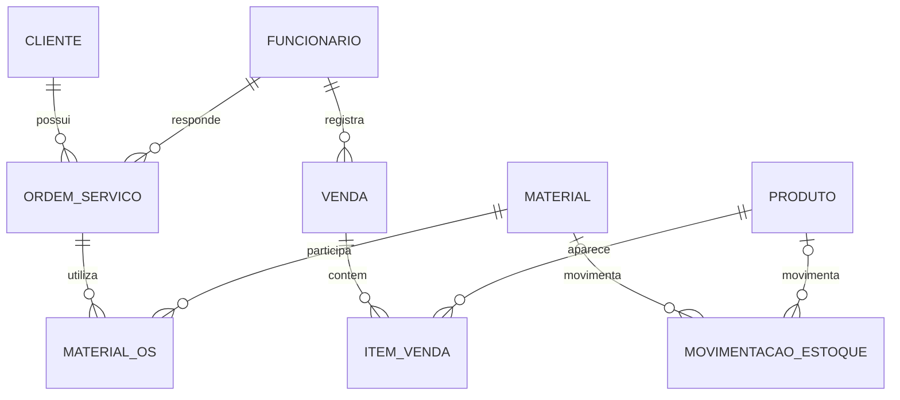

# Modelo de dados — visão inicial do sistema

[Índice](README.md) · [Guia do Projeto](guia-do-projeto.md) · [Contrato da API](api.md) · [Telas e fluxos](telas-e-fluxos.md)

## Escopo e situação

Modelo inicial do banco completo, sujeito a evolução. O contrato da API e o documento de telas apresentam o mesmo conjunto de funcionalidades, com detalhes pendentes marcados localmente; as nove tabelas de negócio estão aplicadas, com cadastros, consultas e operações de estoque, OS e vendas implementados.

- **Definição da equipe:** objetivos dos módulos (Guia §§1.3, 4 e 5; RF-003 a RF-011), PostgreSQL (§7.1), cadastro de funcionários exclusivo do administrador (RN-001) e venda independente de OS (RN-008).
- **Exigência acadêmica:** validação, chaves estrangeiras, consistência, estoque não negativo e segurança (§8.2; RNF-004/RNF-005, RN-018/RN-019).
- **Sugestões das fontes:** entidades e campos do §10, detalhes do §5 e fluxos do §6. Sua presença neste modelo não os aprova.
- **Implementação aprovada:** nove tabelas de negócio em `sapataria`, com campos, tipos, chaves e obrigatoriedade descritos abaixo. Fluxos de gravação e total da venda implementados; cálculo automático da OS e indicadores financeiros pendentes.
- **Pendências de negócio:** apontadas junto aos elementos afetados, por identificadores de [regras de negócio](regras-de-negocio.md#pendencias). Ausência de definição não significa campo opcional.

**Situação atual:** SQL de Clientes, Funcionários e `backend/src/database/entidades.sql` aplicados no Supabase. A última etapa acrescentou sete tabelas, nove FKs e três restrições de estoque/vínculo, sem alterar os dados existentes. Há também três tabelas técnicas de autenticação.

## Convenções adotadas

**PK** é a chave primária: identifica uma linha. **FK** é a chave estrangeira: aponta para uma linha existente de outra tabela. Por exemplo, `cliente_id` aponta para `clientes.id`.

Todas as nove tabelas principais possuem `id integer` gerado pelo banco, PK, único e não nulo. As FKs usam `integer`. Essa exigência técnica de identificação não torna obrigatório um dado cadastral.

A obrigatoriedade abaixo incorpora as decisões confirmadas pelo Integrante 1. Não há unicidade de nomes/contatos nem exclusões em cascata; usuário de login tem unicidade própria. Remoção de Clientes exige ausência de vínculos; Materiais/Produtos exigem também saldo zero. OS/Vendas e movimentos preservam o histórico.

Tipos: `text` para textos; `boolean` para ativo; `numeric` sem escala fixa para valores e quantidades, sem impor arredondamento ainda não aprovado; `date` para datas sem horário; `timestamptz` para instantes. A API retorna numeric como string decimal, date como `YYYY-MM-DD` e timestamptz como ISO 8601 UTC; IDs continuam números inteiros. Essa representação preserva precisão e datas. Restrições de operação permitem frações de materiais e exigem unidades inteiras para produtos; valores monetários têm até duas casas.

## Diagrama geral — relações implementadas

`||` significa exatamente um; `o|`, zero ou um; `o{`, zero ou vários. Cliente e responsável da OS, vendedor da venda e vínculos das tabelas intermediárias são obrigatórios.

```mermaid
erDiagram
    CLIENTE ||--o{ ORDEM_SERVICO : possui
    FUNCIONARIO ||--o{ ORDEM_SERVICO : responde
    FUNCIONARIO ||--o{ VENDA : registra
    ORDEM_SERVICO ||--o{ MATERIAL_OS : utiliza
    MATERIAL ||--o{ MATERIAL_OS : participa
    VENDA ||--o{ ITEM_VENDA : contem
    PRODUTO ||--o{ ITEM_VENDA : aparece
    MATERIAL o|--o{ MOVIMENTACAO_ESTOQUE : movimenta
    PRODUTO o|--o{ MOVIMENTACAO_ESTOQUE : movimenta
```

Um cliente pode estar associado a várias OS; cada OS aponta para exatamente um cliente. Um funcionário pode responder por várias OS e registrar várias vendas. Confirmar se a loja precisa de mais de um responsável por OS antes de mudar essa estrutura (PD-N03).

Uma OS pode utilizar vários materiais e o mesmo material pode aparecer em várias OS: `MATERIAL_OS` registra cada uso. Da mesma forma, `ITEM_VENDA` liga uma venda aos produtos vendidos. A estrutura exige os dois vínculos em cada linha dessas tabelas intermediárias. O diagrama não decide o mínimo de itens para concluir uma venda, nem se o mesmo produto/material pode aparecer repetido na mesma operação (PD-N03/PD-N07).

Cada movimentação aponta **para um Material ou um Produto, nunca ambos**, conforme restrição aplicada no banco; as duas ligações opcionais no diagrama devem ser lidas juntas com essa condição.

**Relações ainda não desenhadas:** Cliente–Venda (histórico de compras sugerido no §5.3, mas ausente no §10) e OS–Venda (vendas ligadas a OS no §1.3, sem modelo correspondente no §10). A existência de venda independente está definida, mas não resolve como representar as vendas ligadas a OS. Cardinalidade e campos desses vínculos permanecem pendentes; não se cria tabela adicional nem FK por suposição (PD-N03/PD-N05).

## Entidades e campos

### Funcionário/usuário — `sapataria.funcionarios`

**Confirmado e implementado:** conta individual com usuário e senha, sem Supabase Auth. Referências: RF-001/RF-005/RF-015/RF-019, RN-001/RN-004. Tabela e índices aplicados no Supabase; verificação com dados temporários revertida.

| Campo | Tipo | Obrigatoriedade / regra |
|---|---|---|
| `id` | `integer` | Gerado pelo banco, chave primária |
| `nome` | `text` | Obrigatório |
| `usuario` | `text` | Obrigatório; único pelo índice `lower(usuario)`; API remove espaços externos e salva em minúsculas |
| `email` | `text` | Obrigatório como contato; não é login; sem unicidade exigida |
| `senha_protegida` | `text` | Obrigatório; hash scrypt com salt; nunca devolvido pela API |
| `perfil` | `text` | Obrigatório; administrador ou funcionario; sem padrão |
| `ativo` | `boolean` | Obrigatório no banco; padrão true |
| `versao_acesso` | `integer` | Técnico; padrão 1; incrementa ao mudar perfil/ativo; invalida sessões anteriores |

A API recebe `senha` (15–128 caracteres), não `senha_protegida`. A senha não é normalizada. Nenhum cadastro público: o primeiro administrador é criado pelo comando local `npm run criar:admin`, que recusa execução quando já existem funcionários. Só administradores autenticados gerenciam as demais contas. Exclusão e recuperação/troca de senha não foram implementadas.

**Tabelas técnicas:** `sessoes` (`sid`, `sess`, `expire`) armazena identificadores e estado de sessão conforme connect-pg-simple; `tentativas_login` (`chave`, `tentativas`, `expira_em`) controla tentativas por usuário/IP com chaves derivadas por HMAC, sem senha. Sessões contêm ID do funcionário, versão de acesso, expiração e token CSRF, não dados da credencial. Limite absoluto de 8h; mudança de acesso exige novo login. Essas tabelas não representam novas entidades de negócio.

O script `backend/src/database/funcionarios.sql` cria apenas essa etapa. Alterações futuras em tabelas existentes deverão ser registradas em novos scripts; `CREATE TABLE IF NOT EXISTS` não atualiza colunas antigas.

## Cliente

**Tabela:** `sapataria.clientes`. Evolução aprovada pelo Integrante 1 em 29/09/2026: CPF obrigatório, telefone de 11 dígitos, CEP e número no lugar do endereço livre, data de cadastro e perfil com OS. Código implementado; migração `backend/src/database/clientes-perfil.sql` preparada e testada apenas em PostgreSQL local descartável, **não aplicada ao banco existente**.

| Campo | Tipo PostgreSQL / JSON | Obrigatoriedade |
|---|---|---|
| `id` | `integer` / número | Gerado pelo banco |
| `nome` | `text` / string | Obrigatório |
| `telefone` | `text` / string | Obrigatório, 11 dígitos |
| `cpf` | `text` / string | Obrigatório, 11 dígitos e verificação dos dígitos na API |
| `cep` | `text` / string | Obrigatório, 8 dígitos |
| `numero` | `text` / string | Obrigatório; aceita identificação como `123A` ou `S/N` |
| `criado_em` | `timestamptz` / string ISO | Automático para novos registros; somente leitura |
| `endereco` | `text` / string ou null | Preservado apenas como dado legado |
| `email`, `observacoes` | `text` / string ou null | Opcionais |

CPF, telefone e CEP são persistidos sem pontuação. A interface aplica máscaras. Não foi acrescentada unicidade de CPF ou contatos. A validação de CPF verifica o cálculo, sem consultar sua situação cadastral. E-mail mantém validação básica; opcionais vazios viram `NULL`.

A migração preserva CPF/CEP/número/data ausentes dos registros antigos, sem inventar valores nem converter endereço livre automaticamente. Restrições `CHECK ... NOT VALID` não revalidam linhas antigas, mas exigem os campos nas novas inserções e atualizações. A API também exige todos os campos obrigatórios no PUT. A data antiga permanece desconhecida, mesmo após edição. O script não remove o endereço legado nem altera vínculos de OS.

Somente CEP e número são gravados como novo endereço. Rua, bairro, cidade e UF são consultados no ViaCEP pela interface; campos ausentes na resposta são apresentados como não informados. Falha da consulta não impede salvar os dados informados e não equivale a validação da existência do CEP pela API. RF-003/RF-017/RF-026.

### Pendências de Clientes

- Clientes exige login e permite os dois perfis; operações de alteração exigem token CSRF. Exclusão permitida somente sem OS vinculada.

## Ordem de serviço — `ordens_servico`

RF-004/RF-018. Todos os campos abaixo são obrigatórios, exceto `prazo_entrega`, `forma_pagamento` e `observacoes`.

| Campo (além de id) | Tipo / vínculo | Definição |
|---|---|---|
| cliente_id | integer → clientes.id | Cliente atendido |
| responsavel_id | integer → funcionarios.id | Responsável pelo serviço; não define automaticamente autoria |
| descricao_calcado | text | Descrição do calçado |
| servico | text | Descrição do serviço nesta etapa; não foi criado catálogo auxiliar |
| valor | numeric | Valor informado, sem cálculo automático |
| data_entrada | date | Padrão: data do registro em America/Sao_Paulo |
| prazo_entrega | date, opcional | Sem prazo padrão |
| status | text | Padrão Aberta; Em andamento, Pronta, Entregue ou Cancelada, conforme RN-010 |
| forma_pagamento | text, opcional | pix, credito, debito ou dinheiro |
| observacoes | text, opcional | Anotações |

Usos de materiais ficam em `materiais_os`. Cadastro, edição, avanço de status, consumo, devolução e cancelamento estão disponíveis na API, conforme RN-010/RN-012. O cálculo da OS foi adiado pelo usuário.

## Estoques — `materiais` e `produtos`

RF-007/RF-008, RF-021/RF-022. Todos os campos são obrigatórios no banco. Ambos têm saldo `quantidade numeric NOT NULL DEFAULT 0 CHECK (quantidade >= 0)`, conforme RN-019.

| Tabela | Campos além de id |
|---|---|
| materiais | nome text, categoria text, unidade text, quantidade numeric, quantidade_minima numeric, custo numeric |
| produtos | nome text, categoria text, quantidade numeric, preco_custo numeric, preco_venda numeric |

Categoria e unidade são textos nesta etapa. Sem catálogo, lista fechada ou unicidade de nome presumida. Somente o saldo tem padrão zero; quantidade mínima, custos e preços não receberam valores padrão. Custo é por unidade informada; materiais aceitam frações e produtos inteiros. Valores monetários não negativos, com até duas casas; mínimo não negativo. Cadastro/edição não alteram saldo. Entradas, saídas, consumo, venda e reversões atualizam movimento e saldo juntos (RN-018). Alertas continuam pendentes.

## Venda — `vendas`

RF-006/RF-020, RN-008. Campos obrigatórios, exceto cancelada_em:

| Campo (além de id) | Tipo / vínculo | Definição |
|---|---|---|
| data | timestamptz | Padrão CURRENT_TIMESTAMP; instante do registro |
| vendedor_id | integer → funcionarios.id | Funcionário autenticado que registra a venda |
| forma_pagamento | text | pix, credito, debito ou dinheiro |
| total | numeric | Soma exata de quantidade × preco_unitario dos itens |
| cancelada_em | timestamptz, opcional | Nulo em venda vigente; instante automático de cancelamento |

A venda não exige OS. Não foram acrescentados cliente_id, ordem_servico_id, desconto, imposto ou parcelas. POST grava venda, itens, movimentos e baixa juntos. Cancelamento mantém os registros e total originais; devolve somente as quantidades efetivamente retornadas.

## Item de venda — `itens_venda`

Todos os campos obrigatórios: `venda_id integer` → vendas.id; `produto_id integer` → produtos.id; `quantidade numeric`; `preco_unitario numeric`, além de id gerado. Quantidade não recebe padrão zero. Não há unicidade por venda/produto. Quantidade inteira positiva; preco_unitario copia o preço de venda do produto e permanece no histórico. Consulta em `GET /vendas/:id/itens`; sem CRUD independente.

## Material utilizado em OS — `materiais_os`

Todos os campos obrigatórios: `ordem_servico_id integer` → ordens_servico.id; `material_id integer` → materiais.id; `quantidade_usada numeric`, além de id gerado. Quantidade não recebe padrão zero. Não há unicidade por OS/material nem fórmula de custo. Quantidade positiva, fracionável. Registrar um uso na API baixa o material e cria uma movimentação vinculada, na mesma transação. Consulta em `GET /ordens-servico/:id/materiais`; sem CRUD independente.

## Movimentação de estoque — `movimentacoes_estoque`

| Campo (além de id) | Tipo / vínculo | Obrigatoriedade |
|---|---|---|
| tipo | text | Obrigatório: entrada ou saida |
| material_id | integer → materiais.id | Condicional |
| produto_id | integer → produtos.id | Condicional |
| quantidade | numeric | Obrigatória, sem padrão zero |
| data | timestamptz | Obrigatória; padrão CURRENT_TIMESTAMP |
| motivo | text | Obrigatório; informado na operação manual ou gerado pelo fluxo |
| item_venda_id | integer → itens_venda.id, único quando preenchido | Somente saída originada por item de venda |
| material_os_id | integer → materiais_os.id, único quando preenchido | Somente saída originada por uso de material |
| reversao_de_id | integer → movimentacoes_estoque.id | Reversão/devolução vinculada ao movimento original |

A restrição `movimentacao_um_item` exige **exatamente um** entre material_id e produto_id; nenhum ou ambos são rejeitados pelo banco. Quantidade positiva e finita; produtos exigem inteiros. No máximo um vínculo de origem (item_venda_id, material_os_id, reversao_de_id). Movimento manual não possui origem. Vendas/usos geram uma saída por linha; devoluções apontam para essa saída. Bloqueios transacionais na API impedem reversões acima da quantidade original. Não há edição/exclusão de movimentos na API.

**Alteração incremental aplicada no Supabase:** `backend/src/database/operacoes.sql`, após os três scripts de estrutura anteriores. Acrescenta restrições e vínculos sem inserir dados nem converter valores existentes. A aplicação usa transações para manter saldos coerentes; inserir diretamente uma linha por SQL não executa os fluxos da API.

## Cadastros auxiliares e informações calculadas

O Guia §5.10 sugere cadastros auxiliares, mas ainda não resolve seu formato. Avaliação inicial, **não aprovada**:

| Assunto | Necessidade respaldada e representação a avaliar |
|---|---|
| Tipos de serviço | Se a Configuração administrar um catálogo, considerar `tipos_servico` com `id` PK e `nome text` (obrigatoriedade pendente). Um ou vários serviços por OS precisa ser definido antes de escolher FK única ou tabela de ligação (PD-N03/PD-N04). |
| Formas de pagamento | Se houver catálogo administrável, considerar `formas_pagamento` com `id` PK e `nome text` (obrigatoriedade pendente), referenciado por OS/Venda. As quatro opções atuais foram confirmadas; um catálogo administrável permanece pendente. |
| Categorias de produtos e materiais | Se forem administradas em Configuração, considerar cadastro com `id` PK e `nome text` (obrigatoriedade pendente). Catálogo compartilhado ou separado ainda não definido; não duplicar tabelas nem fixar uma categoria obrigatória por item (PD-N03). |
| Dados da empresa e parâmetros financeiros | Previstos em §5.10, mas sem campos ou regras suficientes. Representação pendente; não criar tabela genérica de configurações nem fixar alíquota (PD-N03/PD-N06). |

Login, Perfil e Dashboard não são novas entidades só por serem telas. Faturamento, lucro, imposto e gastos são indicadores previstos (§5.11); propõe-se obtê-los dos registros operacionais quando fórmulas e datas forem aprovadas, sem tabelas espelhando cada indicador. Histórico de custos/recebimentos poderá exigir dados adicionais conforme PD-N05/PD-N06; os campos atuais não garantem cálculo financeiro correto.

## Sequência sugerida de implementação

A estrutura, consultas e operações aprovadas foram implementadas. A sequência histórica abaixo foi atendida nos pontos descritos nesta atualização; ampliações continuam sujeitas às decisões da equipe:

1. **Base de persistência e cadastros:** alinhar convenções e mecanismo de migrações (PD-R09); implementar `clientes` e `funcionarios` após confirmar seus campos e acesso. Preservar o contrato inicial de Clientes ou revisá-lo explicitamente se a equipe aprovar outra representação.
2. **Itens de estoque e auxiliares necessários:** `materiais` e `produtos`; criar apenas os auxiliares efetivamente aprovados antes de suas FKs. Confirmar unidades e significado dos custos.
3. **Operações principais:** `ordens_servico` e `vendas`, seguidas de `materiais_os` e `itens_venda`. Confirmar serviços, autoria e vínculos com cliente/OS antes dos fluxos afetados.
4. **Movimentações e consistência:** `movimentacoes_estoque` e suas relações de origem, após PD-N07. Implementar operações conjuntas e proteção contra saldo negativo **antes de habilitar vendas ou usos que devam movimentar estoque**; a ordem das tabelas não autoriza fluxo parcialmente consistente.
5. **Financeiro e refinamentos:** resolver recebimentos, custo histórico, fórmulas e períodos antes dos indicadores. Evoluir o esquema e refinar os contratos e telas somente conforme essas regras.

As pendências são locais: dúvidas financeiras não impedem preparar Clientes, mas impedem apresentar lucro correto como funcionalidade pronta. Regras de remoção e histórico (PD-N09) devem ser resolvidas antes de habilitar essas operações, sem exclusão em cascata implícita.
